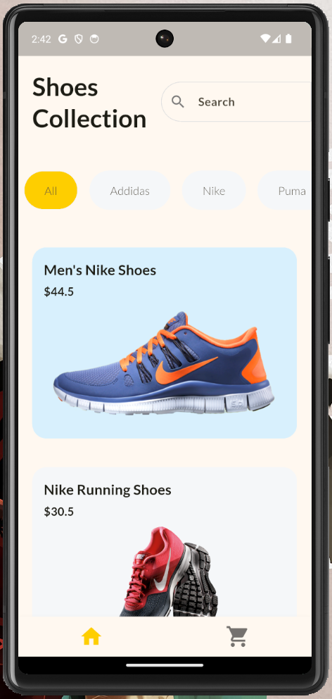
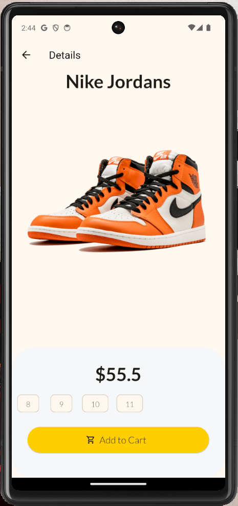
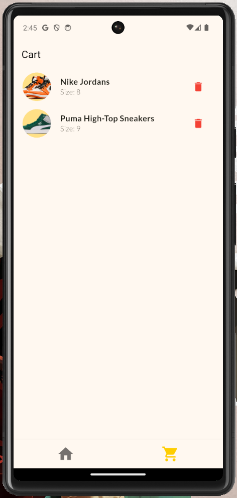

# 🛒 Flutter Shopping App

A sleek, **responsive** shopping app built using **Flutter** and **Dart**. This project showcases products with filtering and search capabilities, detailed product views, and a functional shopping cart — delivering a smooth and adaptive e-commerce experience on both mobile and desktop.

---

## ✨ Features

- 🏠 **Home Page**
  - Displays a list/grid of all available products.
  - **Search bar** to find products quickly.
  - **Filter by brand** using interactive buttons.
  - Fully **responsive** UI across screen sizes.

- 📄 **Product Detail Page**
  - View product image, title, brand, price, and sizes.
  - **Select size** before adding to cart.
  - **Add to cart** functionality.

- 🛍 **Cart Page**
  - View added products with selected size.
  - **Delete** items from the cart.
  - Real-time updates and a clean layout.

---

## 📸 Screenshots

> Screenshots of the app UI on various screens:

### 🏠 Home Page  

### 📄 Product Details  

### 🛒 Cart Page  

---

## 🧱 Tech Stack

- **Flutter** – Cross-platform UI toolkit for building native apps
- **Dart** – Programming language used with Flutter
- **State Management** – Using `Provider`
- **Responsive Design** – UI adapts to different screen sizes using `LayoutBuilder` along with GridView and ListView builders.